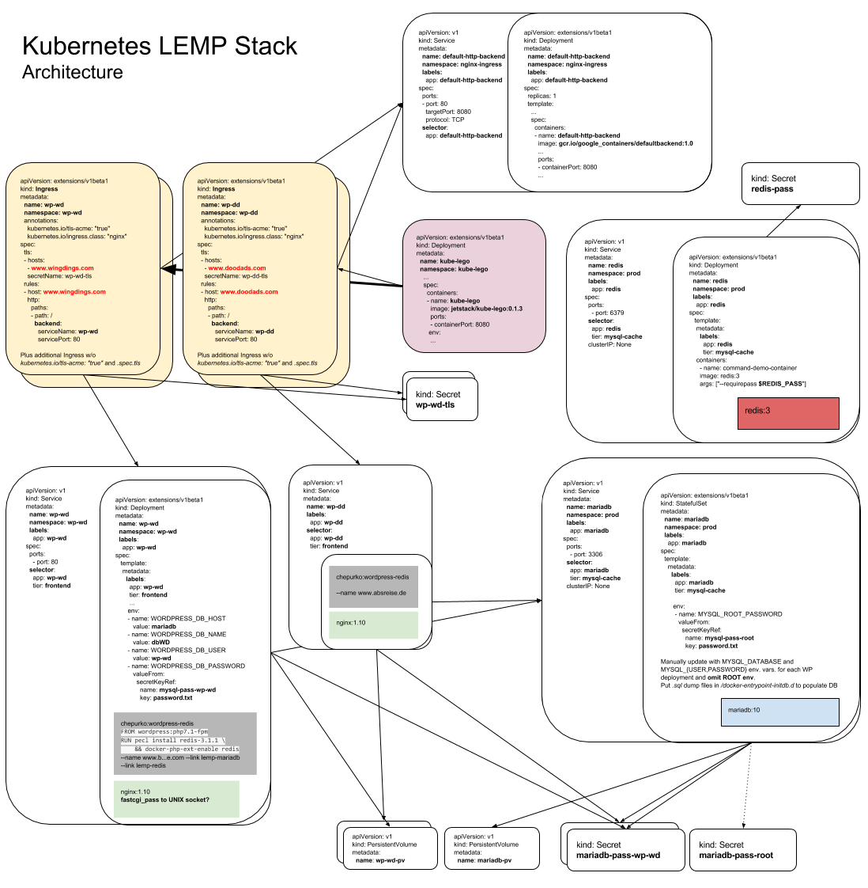

# Kubernetes LEMP Stack
Kubernetes LEMP Stack is a distributed LEMP stack built on top of a Kubernetes cluster. It enables anyone to deploy multiple CMSs (currently Wordpress) for any number of websites.

Currently this supports Google Compute Engine as a cloud provider. Other providers haven't been tested (things like `PersistentVolume` and `Ingress` depend on your cloud provider).

There are already stable [turn-key deployments for various CMSs](https://github.com/kubernetes/charts "Helm Charts") via Kubernetes Helm Charts, but **Kubernetes LEMP Stack** is designed more or less in the traditional LEMP fashion where you get a bucket for all of your HTML at `/var/www/html` and you may or may not use a CMS.

Actually, **k8s LEMP Stack** should be able to serve as your own personal web server farm! Use it as a backend to your own cloud hosting company! We also want extra customisation in terms of our web server and security hardening measures. In addition, future improvements aim to make this software scalable and highly-available.

## How It Works
* **Wordpress/NGINX**
  * Each Wordpress CMS is based on the [wordpress:php7.1-fpm](https://hub.docker.com/r/_/wordpress/ "Official Wordpress Docker image") image with extra required PHP extensions such as `redis`. Wordpress is contained in one `Deployment` controller along with an `nginx` container. The `nginx` image is planned to include build-time security enhancements such as the [NAXSI WAF](https://github.com/nbs-system/naxsi "NBS System NAXSI Web Application Firewall").
  * Each Wordpress/NGINX `Deployment` gets it's own `PersistentVolume` as well as `Secret` objects for storing sensitive information such as passwords for their DBs.
  
* **MariaDB**
  * Initially, the Wordpress/NGINX pods all interface with one `mariadb` `StatefulSet`. This is so anyone can start off with a full-fledged web farm and bring up any number of websites using one `mariadb` instance with a databse for each site. Future improvements will allow for HA and scalable clustered RDBMSs.
  * `mariadb` also gets a `PersistentVolume` and `Secret` objects.
  * Updating `StatefulSet` objects in Kubernetes is [currently a manual process](https://kubernetes.io/docs/concepts/workloads/controllers/statefulset/#limitations), meaning we have to execute MySQL commands in the `mariadb` pod to add new databases and users.
  
* **Redis**
  * To reduce hits to the DB we build the WP/NGINX image with the `redis` PHP extension and include a Redis `Deployment`.
  * WP must be configured to use Redis upon initialising a new WP site by installing and configuring the WP [Redis Object Cache](https://wordpress.org/plugins/redis-cache/ "Redis Object Cache plugin for Wordpress") plugin. We protect Redis with a password in a `Secret`.
  
* **Ingress/Kube Lego**
  * Websites are reached externally via an `nginx` `Ingress` controller. See Kubernetes documentation regarding `Ingress` in the [official docs](https://kubernetes.io/docs/user-guide/ingress/ "Ingress Resources") and on [GitHub](https://github.com/kubernetes/ingress/blob/master/controllers/nginx/README.md "NGINX Ingress Controller").
  * All TLS is terminated at `Ingress` via free Let's Encrypt certificates good for all domains on your cluster. Better yet, certificate issuance is handled automatically with the awesome [Kube Lego](https://github.com/jetstack/kube-lego "Kube Lego").
  


## TODO
- [x] Add diagram detailing the general structure of the cluster
- [ ] Configure PHP to listen on a UNIX socket instead of port 9000 and pass the socket file to the `fastcgi_pass` parameter in NGINX.
- [ ] Explore a logging solution for cluster pods such as [Logstash](https://www.elastic.co/guide/en/logstash/current/docker.html "Running Logstash on Docker")
- [ ] High availability
  - [ ] [Ceph distributed storage](https://github.com/ceph/ceph-docker/tree/master/examples/kubernetes "Ceph on Kubernetes")
  - [ ] \(Optional\) HA MySQL via sharding, [clustering](https://thenewstack.io/deploy-highly-available-wordpress-instance-statefulset-kubernetes-1-5/ "Deploy a Highly Available WordPress Instance as a StatefulSet in Kubernetes 1.5"), etc.
  - [ ] Add shared and distributed storage to Wordpress/NGINX deployments so they can then be replicated
- [ ] Enable Drupal CMSs
- [ ] Enable Joomla CMSs
- [ ] Enable generic "HTML" deployments
- [ ] Explore segregating the website deployments in the name of privacy/hardening
 
## Installation
### Create Namespaces:
  ```bash
  $ kubectl apply -f 00-namespace.yaml
  namespace "core" created
  $ kubectl apply -f wp/00-namespace.yaml 
  namespace "wp-be" created
  $ kubectl apply -f nginx/00-namespace.yaml 
  namespace "nginx-ingress" created
  $ kubectl apply -f lego/00-namespace.yaml 
  namespace "kube-lego" created
  ```
### Create NGINX Ingress and `default-http-backend` (to catch invalid requests to ingress and serve 404):
 ```bash
  $ kubectl apply -f nginx/
  namespace "nginx-ingress" configured
  service "default-http-backend" created
  deployment "default-http-backend" created
  service "nginx" created
  ~~configmap "nginx" created~~
  deployment "nginx" created
  ```
  
* GCE should give you a `LoadBalancer` for your NGINX Service. Watch for your public IP address:
  ```bash
  $ watch kubectl describe svc nginx --namespace nginx-ingress
  ...
  LoadBalancer Ingress:   1.2.3.4
  ...
  ```
* Go to your domains DNS settings and point your domain to this IP address. After DNS propogates you should see the message "default backend - 404" straight away when visiting your newly set-up domain in a browser. This is the `default-http-backend` doing it's job.

### Create `Secret` objects `mariadb-pass-root` and `redis-pass`:
  ```bash
  $ openssl rand -base64 20 > /tmp/mariadb-pass-root.txt
  $ openssl rand -base64 20 > /tmp/redis-pass.txt
  $ kubectl create secret generic mariadb-pass-root --from-file=/tmp/mariadb-pass-root.txt --namespace=core
  $ kubectl create secret generic redis-pass --from-file=/tmp/redis-pass.txt --namespace=core
  ```
### Create persistent disks (GCE) and your "core" services:
* Make sure the disks are in the same `<zone>`as your cluster and that the names match the `pdName` from `gce-volumes.yaml`:
  ```bash
  $ gcloud compute disks create --size=10GB --zone=<zone> wp-be
  $ gcloud compute disks create --size=10GB --zone=<zone> mariadb
  $ kubectl apply -f gce-volumes.yaml
  $ kubectl apply -f mariadb-StatefulSet.yaml
  $ kubectl apply -f mariadb-StatefulSet.yaml
  ```
### Bring up Wordpress/NGINX
~~* Create a `ConfigMap` for `nginx`:~~
  ```bash
  $ kubectl create configmap nginx-config --from-file=wp/ConfigMaps/nginx/ --namespace=wp-be 
  ```
* Create a new `Secret` for your new DB user
  ```bash
  $ openssl rand -base64 20 > /tmp/mariadb-pass-wp-be-s.txt
  $ kubectl create secret generic mariadb-pass-wp-be-s --from-file=/tmp/mariadb-pass-wp-be-s.txt --namespace=wp-be
  ```
* Deploy Wordpress/NGINX and `notls-Ingress`
  ```bash
  $ kubectl apply -f wp/wp-be-Deployment.yaml
  ```

## Usage

### Adding a website
* Manually add a new database in the `mariadb` `StatefulSet` and grant privileges to a new user.
  ```bash
  $ kubectl --namespace=core exec -it mariadb-0 -- /bin/bash
  root@mariadb-0:/# mysql -u root -p"$MYSQL_ROOT_PASSWORD"
  ```
* Create a new `Secret` for your new DB user
  ```bash
  $ commands
  ```
* Or restore a database from a previous or backed up website:
  ```bash
  $ kubectl cp /path/to/DBbackup/dbWPWD.bak.sql core/mariadb-0:/root/dbWPWD.bak.sql
  $ kubectl --namespace=core exec -it mariadb-0 -- /bin/bash
  root@mariadb-0:/# mysql -u chepwp -p"$MYSQL_ROOT_PASSWORD" dbWPWD < dbWPWD.bak.sql
  ```

* Declare your new website in another directory
  * Make a copy of the `/wp` directory and give it a short name with your website in mind, e.g. `/wp-wd` for "www.wingdings.com"
  * Update the following values in your new `/wp-wd/wp-wd-Deployment.yaml` file to the corresponding website short name. E.g. `wp-wd`, `wp-wd-pv-claim`, etc.
    * `.metadata.name`
    * `.metadata.labels.app`
    * `Service` definition
      * `.spec.selector.app`
    * `PersistentVolumeClaim` definition
      * `.spec.selector.matchLabels.app`
    * `Deployment` definition
      * `.spec.template.metadata.labels.app`
      * Update all `.spec.template.spec.containers[0].env[].value` fields to match your new database name, user, and password from `Secret`
      * `.volumes[0].persistentVolumeClaim.claimName`
  * Also update the `.metadata.name` value of `00-namespace.yaml`
  * Finally update the values in both `\*tls-Ingress.yaml` files:
    * `.metadata.name|namespace`
    * Both `.host\*` values
    * `.spec.rules[0].http.paths.backend.serviceName`

* Add a new `PersistentVolume` definition into `gce-volumes.yaml` with your corresponding website short name.

## Acknowledgements
This project was inspired by the official Kubernetes [Wordpress + MySQL sample](https://github.com/kubernetes/kubernetes/tree/master/examples/mysql-wordpress-pd/ "Persistent Installation of MySQL and WordPress on Kubernetes") and builds on it with the various other official Docker images and Kubernetes applications mentioned previously.
